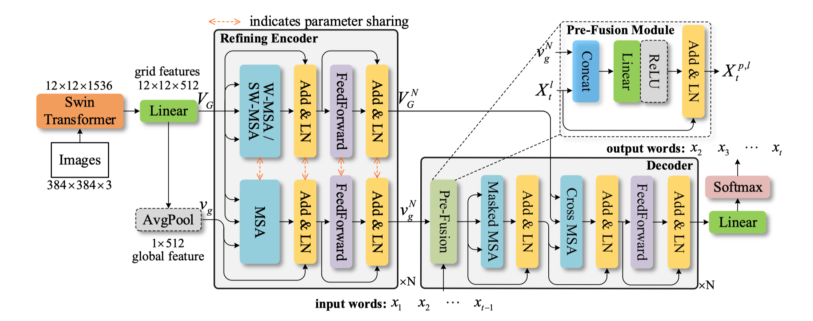

# PureT
论文 __End-to-End Transformer Based Model for Image Captioning__ [[PDF/AAAI]](https://ojs.aaai.org/index.php/AAAI/article/view/20160) [[PDF/Arxiv]](https://arxiv.org/abs/2203.15350) 的PyTorch实现 [AAAI 2022]



## 环境要求 (Our Main Enviroment)
+ Python 3.7.4
+ PyTorch 1.5.1
+ TorchVision 0.6.0
+ [coco-caption](https://github.com/tylin/coco-caption)
+ numpy
+ tqdm

## 预处理
### 1. coco-caption
参考coco-caption的 [README.md](./coco_caption/README.md), 主要是需要下载SPICE指标需要使用的[Stanford CoreNLP 3.6.0](http://stanfordnlp.github.io/CoreNLP/index.html)代码和模型。 直接使用脚本下载即可:
```bash
cd coco_caption
bash get_stanford_models.sh
```
### 2. 数据准备
训练和验证过程所需要的重要数据都存储在 __`mscoco`__ 路径下，文件夹组织结构如下：
```
mscoco/
|--feature/
    |--coco2014/
       |--train2014/
       |--val2014/
       |--test2014/
       |--annotations/
|--misc/
|--sent/
|--txt/
```
[MSCOCO 2014](https://cocodataset.org/#download) 数据集的所有源图像和注释文件置于`mscoco/feature/coco2014`路径下。其余文件可通过[GoogleDrive](https://drive.google.com/drive/folders/1HBw5NGGw8DjkyNurksCP5v8a5f0FG7zU?usp=sharing)或者[百度网盘](https://pan.baidu.com/s/1tyXGJx50sllS-zylN62ZAw)(提取码: hryh)进行下载。

__注意:__ 为了进一步加快训练速度，也可以将数据集中所有图像的特征提取出来并保存为npz文件，可以在`mscoco/feature`路径下新建目录存储特征文件，训练和验证时需要将数据集读取改为[coco_dataset.py](datasets/coco_dataset.py)和[data_loader.py](datasets/data_loader.py)中的方式。同时也需要修改[pure_transformer.py](models/pure_transformer.py)（主要就是删除掉Backbone模块的定义，其余类和函数的接口应该是通用的）。

## 模型训练
*注意: 代码实现主要基于[JDAI-CV/image-captioning](https://github.com/JDAI-CV/image-captioning)，直接复用了他们的配置文件没做太多修改，所以里面会有一些对我们模型无用的超参数设置。（需要进一步整理删除）*

### 1. XE损失下训练
首先从[GoogleDrive](https://drive.google.com/drive/folders/1HBw5NGGw8DjkyNurksCP5v8a5f0FG7zU?usp=sharing)或者[百度网盘](https://pan.baidu.com/s/1tyXGJx50sllS-zylN62ZAw)(提取码: hryh)中下载Backbone(Swin-Transformer)的预训练模型，并将其存储在当前工程的根目录下。（预训练模型来源于SwinTransformer官方开源库，去除了其中的head模块部分的权重）

在训练前，可能还需要检查和修改`config.yml`和`train.sh`文件以适应你的运行环境。然后直接开训：

```
# for XE training
bash experiments_PureT/PureT_XE/train.sh
```
### 2. SCST训练
将XE训练后相对较好的模型复制并存储于`experiments_PureT/PureT_SCST/snapshot/`中。然后继续训练：

```bash
# for SCST training
bash experiments_PureT/PureT_SCST/train.sh
```

## 模型测试
可以直接从[GoogleDrive](https://drive.google.com/drive/folders/1HBw5NGGw8DjkyNurksCP5v8a5f0FG7zU?usp=sharing)或[百度网盘](https://pan.baidu.com/s/1tyXGJx50sllS-zylN62ZAw)(提取码: hryh)下载论文中报告结果所对应的预训练模型。 

```bash
CUDA_VISIBLE_DEVICES=0 python main_test.py --folder experiments_PureT/PureT_SCST/ --resume 27
```

|BLEU-1|BLEU-2|BLEU-3|BLEU-4|METEOR|ROUGE-L| CIDEr |SPICE |
| ---: | ---: | ---: | ---: | ---: | ---:  | ---:  | ---: |
| 82.1 | 67.3 | 52.0 | 40.9 | 30.2 | 60.1  | 138.2 | 24.2 |


## Reference
If you find this repo useful, please consider citing (no obligation at all):
```
@inproceedings{wangyiyu2022PureT,
  title={End-to-End Transformer Based Model for Image Captioning},
  author={Yiyu Wang and Jungang Xu and Yingfei Sun},
  booktitle={AAAI},
  year={2022}
}
```

## Acknowledgements
This repository is based on [JDAI-CV/image-captioning](https://github.com/JDAI-CV/image-captioning), [ruotianluo/self-critical.pytorch](https://github.com/ruotianluo/self-critical.pytorch) and [microsoft/Swin-Transformer](https://github.com/microsoft/Swin-Transformer).
